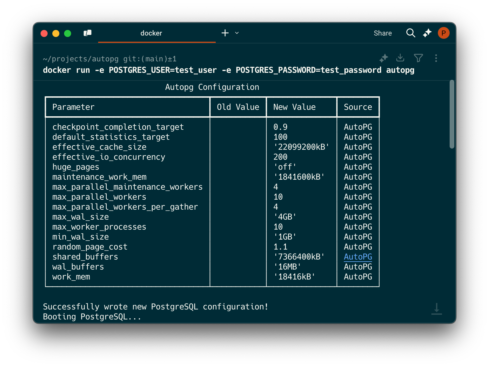

# autopg

[](https://github.com/piercefreeman/autopg/pkgs/container/autopg)
[](https://github.com/piercefreeman/autopg/actions)
[](https://github.com/piercefreeman/autopg/actions)

Auto-optimizations for postgres to maximize host hardware.



This is a proof-of-concept Docker image to automatically optimize the PostgreSQL configuration depending on the host device.

## Usage

`autopg` should be a direct replacement for using the `postgres` docker image in your architecture - be that Docker, Kubernetes, etc.

For example, in `docker-compose.yml` file, add the following:

```yaml
services:
  postgres:
    image: ghcr.io/piercefreeman/autopg:pg16-latest
    ports:
      - 5432:5432
```

We use reasonable system defaults when you launch without any env variables. We will sniff the docker container for its host machine's hardware and use that to generate the `postgresql.conf` file. But if you want to customize your specific deployment we support two methods:

1. Env overrides for autopg inputs

| Env Variable | Default | Description |
| ------------ | ------- | ----------- |
| `AUTOPG_DB_TYPE` | `WEB` | What kind of application will be using the db |
| `AUTOPG_TOTAL_MEMORY_MB` | `None` | Total memory of the host in MB |
| `AUTOPG_CPU_COUNT` | `None` | Number of CPUs on the host |
| `AUTOPG_NUM_CONNECTIONS` | `100` | Max number of concurrent connections to the db |
| `AUTOPG_PRIMARY_DISK_TYPE` | `None` | Type of the primary disk (SSD or HDD) |

2. Existing `postgresql.conf` file

Mount a `postgresql.conf` file into the container at `/etc/postgresql/postgresql.conf`. Any values explicitly provided in the `postgresql.conf` file will override the values generated by autopg. We'll also merge in any values from this file that autopg does not support directly, so this is a great way to add additional custom settings.

We build images following {postgres_version}-{autopg_version} tags. Use this table to find your desired version:

| Postgres Version | Autopg Version | Tag |
| ---------------- | -------------- | --- |
| 17               | latest          | `autopg:17-latest` |
| 16               | latest          | `autopg:16-latest` |
| 15               | latest          | `autopg:15-latest` |
| 14               | latest          | `autopg:14-latest` |
| 13               | latest          | `autopg:13-latest` |
| 12               | latest          | `autopg:12-latest` |
| 11               | latest          | `autopg:11-latest` |
| 10               | latest          | `autopg:10-latest` |

## Algorithm

The algorithm is a direct Python conversion from [pgtune](https://pgtune.leopard.in.ua/). If you notice any discrepancies in output from the two tools, please report them to Issues (or better yet - add a test case).

## Getting Started

```bash
uv sync
```

```bash
uv run autopg
```

To test the docker build pipeline locally, run:

```bash
docker build --build-arg POSTGRES_VERSION=16 -t autopg .
```

```bash
docker run -e POSTGRES_USER=test_user -e POSTGRES_PASSWORD=test_password autopg
```

## Limitations

- Right now we write the optimization logic in Python so our postgres container relies on having a python interpreter installed. This adds a bit to space overhead and is potentially a security risk. We'd rather bundle a compiled binary that serves the same purpose.
