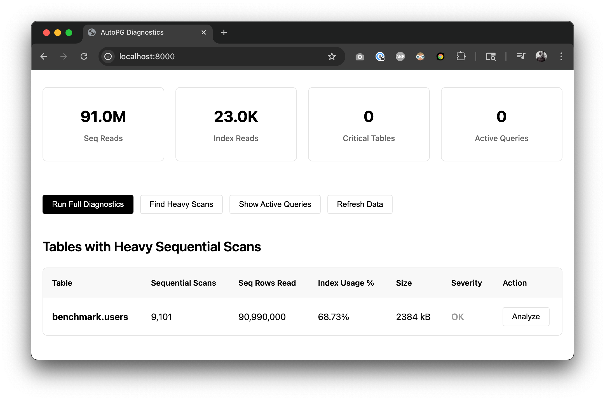

# autopg


[](https://github.com/piercefreeman/autopg/pkgs/container/autopg)
[](https://github.com/piercefreeman/autopg/actions)
[](https://github.com/piercefreeman/autopg/actions)

Auto-optimizations for postgres to maximize speed and utilization of host hardware.

## Usage

`autopg` should be a direct replacement for using the `postgres` docker image in your architecture - be that Docker, Kubernetes, etc.

For example, in `docker-compose.yml` file, add the following:

```yaml
services:
  postgres:
    image: ghcr.io/piercefreeman/autopg:pg16-latest
    ports:
      - 5432:5432
```

We use reasonable system defaults when you launch without any env variables. We will sniff the docker container for its host machine's hardware and use that to generate the `postgresql.conf` file. But if you want to customize your specific deployment we support two methods:

1. Env overrides for autopg inputs

| Env Variable | Default | Values | Description |
| ------------ | ------- | ------ | ----------- |
| `AUTOPG_DB_TYPE` | `WEB` | `WEB`, `OLTP`, `DW`, `DESKTOP`, `MIXED` | What kind of application will be using the db |
| `AUTOPG_TOTAL_MEMORY_MB` | `None` | Integer | Total memory of the host in MB |
| `AUTOPG_CPU_COUNT` | `None` | Integer | Number of CPUs on the host |
| `AUTOPG_NUM_CONNECTIONS` | `100` | Integer | Max number of concurrent connections to the db |
| `AUTOPG_PRIMARY_DISK_TYPE` | `None` | `SSD`, `HDD`, `SAN` | Type of the primary disk |
| `AUTOPG_ENABLE_PG_STAT_STATEMENTS` | `true` | `true`, `false` | Enable pg_stat_statements extension for query statistics |

2. Existing `postgresql.conf` file

Mount a `postgresql.conf` file into the container at `/etc/postgresql/postgresql.conf`. Any values explicitly provided in the `postgresql.conf` file will override the values generated by autopg. We'll also merge in any values from this file that autopg does not support directly, so this is a great way to add additional custom settings.

We build images following {postgres_version}-{autopg_version} tags. Use this table to find your desired version:

| Postgres Version | Autopg Version | Tag |
| ---------------- | -------------- | --- |
| 17               | latest          | `autopg:17-latest` |
| 16               | latest          | `autopg:16-latest` |
| 15               | latest          | `autopg:15-latest` |
| 14               | latest          | `autopg:14-latest` |

## Debugging slow queries



Sequential scans can absolutely kill performance of your webapp, since it requires the database engine to iterate through all your table's data instead of just pulling from a much quicker index cache.

We automatically configure your database with pg_stat, which transparently captures queries that you run against the database. It puts the results in a regular postgres table so you can aggregate the stats like you do with any other Postgres data. While you're free to login as an admin user and query these stats yourself, we bundle a simple webapp to visualize these commands. For security this is disabled by default - if you want to enable it (which you should only be done in firewalled deployments), you can run:

```yml
autopg:
  environment:
    AUTOPG_ENABLE_WEBAPP: true
    AUTOPG_WEBAPP_HOST: 0.0.0.0
    AUTOPG_WEBAPP_PORT: 8000
```

This provides an interface that currently:

- Reports sequential scans and the queries to reproduce
- Reports on the current size of the indexes
- Shows the average and aggregate time spent on different queries
- Shows currently running queries

From there you can create indexes yourself on the most problematic indexes. I suggest running a `EXPLAIN ANALYZE` on an actual query to see how the engine is routing the request, then creating an index to target this slow query, then finally confirming with another analyze.

## Algorithm

The algorithm is a direct Python conversion from [pgtune](https://pgtune.leopard.in.ua/). If you notice any discrepancies in output from the two tools, please report them to Issues (or better yet - add a test case).

## Development

```bash
uv sync
```

```bash
uv run autopg
```

To test the docker build pipeline locally, run:

```bash
docker build --build-arg POSTGRES_VERSION=16 -t autopg .
```

```bash
docker run -e POSTGRES_USER=test_user -e POSTGRES_PASSWORD=test_password autopg
```

## Unit Test

We have unit tests for the logic and integration tests for the docker image.

```bash
uv run pytest -vvv
```

```bash
uv run pytest -vvv -m "integration"
```

## Limitations

- Right now we write the optimization logic in Python so our postgres container relies on having a python interpreter installed. This adds a bit to space overhead and is potentially a security risk. We'd rather bundle a compiled binary that serves the same purpose.
